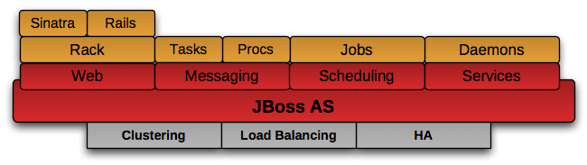

---
#TorqueBox

##Saleem Ansari
###sansari@redhat.com
###@tuxdna

---
## Outline

##What is TorqueBox?
###Polyglot Revolution
###TorqueBox

##How to use TorqueBox?
###Features
###Installation and setup: RVM, JRuby, TorqueBox
###Deployment
###Features contd.

##How to begin hacking TorqueBox?
###JBoss Polyglot
###TorqueBox

---
#What is TorqueBox?

.notes: Before moving onto TorqueBox, let me first introduce you to the Polyglot Revolution. As a matter of fact, you would realize later that TorqueBox is a part of Polyglot Revolution itself. As of today there are many programming languages whose compilers or interpreters target JVM as their target. Those languages include JRuby, Jython, Scala, Erlang ( Erlang on JVM ), and many more. Many of these languages are dynamically typed languages ( or dynamic languages ).

---
#Polyglot Revolution

.notes: What does this enable us to do? Well, basically it enables you to write a program in any of the JVM languages, which gets compiled to Java byte-codes. So, whenever your program written in one JVM language executes, it can also execute the bytecodes generated for any other JVM targeted language. As simple it sounds, it is a very powerful feature because you can now use all your Java code that was written and tested over the years from any other JVM language.

## JVM - This is what makes Polyglot Revolution.

---
#Polyglot Revolution cont.

## It becomes even more useful in enterprise software, where the projects involve multiple technologies. As a part of Polyglot Revolution there are a bunch of projects in different languages:
###TorqueBox (Ruby)
###Immutant (Clojure)
###Blacktie (C++)
###Erjang (Erlang)

---
#back to TorqueBox
##Started in 2009 by Bob McWhirter @bobmcwhirter
##A complete Ruby Application Server
##Why?
###Productivity
###Power and stability of Java Middleware
###Scale on demand

.notes: TorqueBox is a Ruby Application Server. By Application Server I mean that, it is not just a web framework, but it has batteries included. It is built on top of tested and proven technologies. While JRuby provides you ability to call Java code from within your Ruby code ( and vice-versa ), TorqueBox provides the integration at the application level. It provides the ability to consume the services provided by JBoss and write your own if not avaiable.

---
#TorqueBox contd.

##Built on
###JRuby / Ruby
###JBoss AS
###Enterprise Java ( EJB, JMS, Caching etc. )

##Provides
###Messaging
###Jobs
###Caching
###Services
###Clustering

--- 
#TorqueBox howto?
##Installation
###Ruby, RVM and JRuby

    !bash
    yum install -y ruby rubygem-rvm
    rvm-install
    [[ -s "$HOME/.rvm/scripts/rvm" ]] && . "$HOME/.rvm/scripts/rvm"
    rvm install jruby-1.6.5
    rvm use jruby-1.6.5

###TorqueBox (prerelease/latest version)

    !bash
    gem install --pre torquebox
    gem install --pre torquebox-messaging-container
    gem install --pre torquebox-naming-container 
    gem install --pre torquebox-capistrano-support
    gem install --pre torquebox-rake-support
    gem install --pre torquebox-vfs 
    jruby -J-Xmx1024m -w -S \
      gem install --pre torquebox-server \
      --source http://torquebox.org/2x/builds/LATEST/gem-repo

---
#TorqueBox howto?
##Installation contd.

###Rails (latest version)

    !bash
    gem install rails
    gem install bundler

##Some caveats
###JDBC Drivers for Activercord

    !bash
    gem install activerecord-jdbcsqlite3-adapter
    gem install activerecord-jdbcmysql-adapter

---
#TorqueBox howto?
##Create a new Rails application

    !bash
    rails new rails-app
    cd rails-app
    bundle install
    rails g scaffold Person name:string
    rake db:migrate

##and deploy!
    !bash
    torquebox run
    torquebox deploy /path/to/rails-app

---

#Feature: Messaging
##Messaging:
###Create a Message class
###Add que to config/torquebox.yml

---

#Feature: Jobs
##Jobs ( Backgroundable ):
###include TorqueBox::Messaging::Backgroundable to any Ruby class
###get the future ( optionally store it in a serialized format somewhere )
 
---
#Feature: Jobs contd.

##Scheduled Jobs:
###Create a class with run() method
###Add entry on config/torquebox.yml with crontab(5) like time specification

---

#Feature: Caching
##Caching ( via Infinispan ):
###Add gem 'torquebox-cache' to Gemfile
###update application.rb to use torquebox cache

---

#Feature: Clustering
##Clustering:
###torquebox run --clustered
####clustered deployment
####clustered cache
####shared web sessions etc.
###High Availability Singleton Services

    !text
    $JBOSS_HOME/bin/standalone.sh --server-config=standalone-ha.xml
    mark the service as singleon: true in the configuration file
---
#Hacking TorqueBox
##jboss-polyglot
    github.com/projectodd/jboss-polyglot
##TorqueBox
    github.com/torquebox/torquebox
---
#Summary
##JRuby gotchas:
###Pros
    Can invoke Java
    Does Real Threading
    FFI support
###Cons
    Native C extensions written for MRI Ruby dont work

##TorqueBox gotchas:
    Native gems are not supported, except FFI.
    TorqueBox gives you real threads but
     many existing Ruby libraries suck with multi threading.

---
#References

---
#Questions?
---
#Thanks
