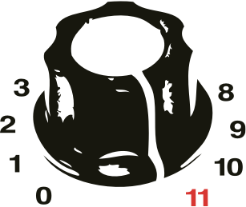
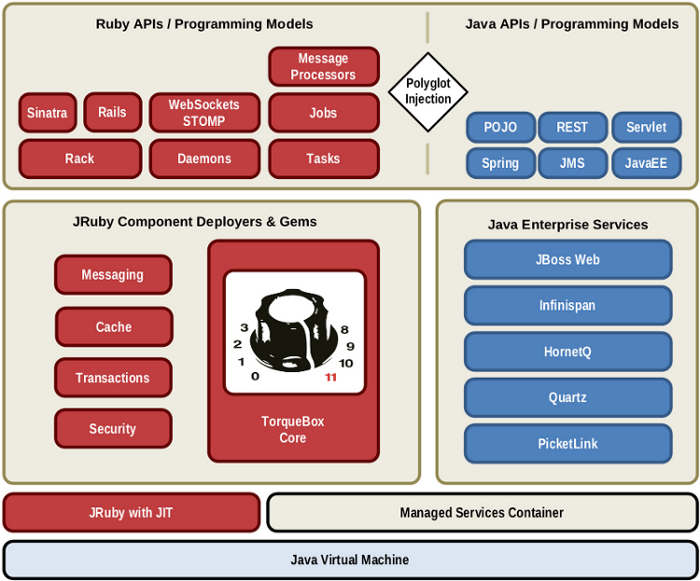

#Presenting...

#Saleem Ansari
    twitter: tuxdna

#10th February, 2012 at GNUnify

---
## Outline

##What is TorqueBox?
###Polyglot Revolution
###TorqueBox

##How to use TorqueBox?
###Features
###Installation and setup: RVM, JRuby, TorqueBox
###Deployment
###Features contd.

##How to begin hacking TorqueBox?
###JBoss Polyglot
###TorqueBox

---
#What is TorqueBox?
## Before that lets talk about Polyglot Revolution

.notes: Before moving onto TorqueBox, let me first introduce you to the Polyglot Revolution. TorqueBox is a part of Polyglot Revolution itself as we will se later. Today there are many programming languages whose compilers or interpreters target the JVM. Those languages include JRuby, Jython, Scala, Erlang ( Erlang on JVM ), and many more. Many of these languages are dynamically typed languages ( or dynamic languages ).

---
#Polyglot Revolution

.notes: What does this enable us to do? Well, basically it enables you to write a program in any of the JVM languages, which gets compiled to Java byte-codes. So, whenever your program written in one JVM language executes, it can also execute the bytecodes generated for any other JVM targeted language. As simple it sounds, it is a very powerful feature because you can now use all your Java code that was written and tested over the years.

## JVM is what makes the Polyglot Revolution.

---
#Polyglot Revolution cont.

## It becomes even more useful in enterprise software, where the projects involve multiple technologies. As a part of Polyglot Revolution there are a bunch of projects in different languages:
###TorqueBox (Ruby)
###Immutant (Clojure)
###Blacktie (C++)
###Erjang (Erlang)

---
#back to TorqueBox
##Started in 2009 by Bob McWhirter @bobmcwhirter
##A complete Ruby Application Server
##Why?
###Productivity
###Power and stability of Java Middleware
###Scale on demand

.notes: TorqueBox is a Ruby Application Server. By Application Server I mean that, it is not just a web framework, but it has batteries included. It is built on top of tested and proven technologies. While JRuby provides you ability to call Java code from within your Ruby code ( and vice-versa ), TorqueBox provides the integration at the application level. It provides the ability to consume the services provided by JBoss and write your own if not avaiable.

---
#TorqueBox contd.

##Built on
###JRuby / Ruby
###JBoss AS
###Enterprise Java ( EJB, JMS, Caching etc. )

##Provides
###Messaging
###Jobs
###Caching
###Services
###Clustering

--- 
#TorqueBox howto?
##Installation
###Ruby, RVM and JRuby

    !bash
    yum install -y ruby rubygem-rvm
    rvm-install
    [[ -s "$HOME/.rvm/scripts/rvm" ]] && . "$HOME/.rvm/scripts/rvm"
    rvm install jruby-1.6.5
    rvm use jruby-1.6.5

###TorqueBox (prerelease/latest version)

    !bash
    gem install --pre torquebox
    gem install --pre torquebox-messaging-container
    gem install --pre torquebox-naming-container 
    gem install --pre torquebox-capistrano-support
    gem install --pre torquebox-rake-support
    gem install --pre torquebox-vfs 
    jruby -J-Xmx1024m -w -S \
      gem install --pre torquebox-server \
      --source http://torquebox.org/2x/builds/LATEST/gem-repo

---
#TorqueBox howto?
##Installation contd.

###Rails (latest version)

    !bash
    gem install rails
    gem install bundler

##Some caveats
###JDBC Drivers for Activercord

    !bash
    gem install activerecord-jdbcsqlite3-adapter
    gem install activerecord-jdbcmysql-adapter

---
#TorqueBox howto?
##Create a new Rails application

    !bash
    rails new rails-app
    cd rails-app
    bundle install
    rails g scaffold Person name:string
    rake db:migrate

##and deploy!
    !bash
    torquebox run
    torquebox deploy /path/to/rails-app

---

#Feature: Messaging (via HornetQ JMS)

##Sending Messages:

    !ruby
    timer_queue = TorqueBox::Messaging::Queue.new('/queues/timer')
    timer_queue.publish "Some Message"
    topic1 = TorqueBox::Messaging::Topic.new('/topics/topic1')
    topic1.publish "Some Topic"

##Processing Messages:

###Create a Message class

    !ruby
    include TorqueBox::Messaging
    class MyMessageHandler < MessageProcessor
      def on_message(body)
        # process the message
      end
    end

###Add queue/topic to config/torquebox.yml

    !yaml
    queues:
      /queues/timer:
    topics:
      /topics/topic1:

    messaging:
      /queues/timer:
        MyMessageHandler:
          concurrency: 5
      /topics/topic1:
        Topic1Handler

---

#Feature: Jobs
##Jobs ( Backgroundable ):
###include TorqueBox::Messaging::Backgroundable to any Ruby class
    !ruby
    class LuceneIndexJob
      include TorqueBox::Messaging::Backgroundable
      def do_index
        # very long running job
      end
    end
###get the future ( optionally store it in a serialized format somewhere )
    !ruby
    indexer = LuceneIndexJob.new
    future = indexer.background.do_index
    future.started?
    future.complete?
    future.error?
    future.status
    # store future object for later retrieval ( maybe in database )

---
#Feature: Jobs contd.

##Scheduled Jobs:
###Create a class with run() method
    !ruby
    class MonthlyBirthdayEmailer
      def run
        # some long task here
      end
    end

###Add entry on config/torquebox.yml with crontab(5) like time specification

    !yaml
    jobs:
      monthly_birthday_notifications:
        description: first of month
        job: MonthlyBirthdayEmailer
        cron: '0 0 0 1 * ?'

---

#Feature: Caching
##Caching ( via Infinispan ):
###Add gem 'torquebox-cache' to Gemfile
    !ruby
    gem 'torquebox-cache'

###update application.rb to use torquebox cache
    !ruby
    class Application < Rails::Application
      config.cache_store = :torque_box_store
    end

###access the cache
    !ruby
    require 'torquebox-cache'
    cache = TorqueBox::Infinispan::Cache.new( :name => 'treasure',
      :persist=>'/data/treasure' )
    # Put some stuff in the cache
    cache.put('akey', "a string value" )
    cache.put("time", Time.now )
    cache.put(user.id, user )
    # Get it back again
    time = cache.get( "time" )
    user = cache.get( params[:id] )

---

#Feature: Services
##Crete a class with initialize, start and stop methods

     !ruby
     class TimeService
       def initialize(opts)
         puts "Queue Name: #{opts['queue']}"
         @queue=TorqueBox::Messaging::Queue.new(opts['queue'])
       end
       def start
         Thread.new{run}
       end
       def stop
         @done=true
       end
       def run
         until @done
           @queue.publish(Time.now)
           sleep(1)
         end
       end
     end

###Add service to application configuration file

    !yaml
    services:
      TimeMachine:
        config:
          queue: /queue/time

---

#Feature: Clustering
##Clustering:
###torquebox run --clustered
####clustered deployment
####clustered cache
####shared web sessions etc.
###High Availability Singleton Services

    !text
    $JBOSS_HOME/bin/standalone.sh --server-config=standalone-ha.xml
    mark the service as singleon: true in the configuration file
---
#Hacking TorqueBox

---
#Hacking TorqueBox contd.

##JBoss-Polyglot
    github.com/projectodd/jboss-polyglot
##TorqueBox
    github.com/torquebox/torquebox

---
#Summary

## Built on Ruby / JRuby, TorqueBox is well suited for rapid application development in the settings where Enterprise Java Applications are already in place.
## TorqueBox Provides these features out of the box, without any hassle:
###Messaging, Jobs, Caching, Services and Clustering

##TorqueBox / JRuby gotchas:
###TorqueBox gives you real threads but many existing Ruby libraries suck with multi threading.
###Can invoke Java
###Does Real Threading
###FFI support
###Native C extensions written for MRI Ruby dont work
###Native gems are not supported, except FFI.

---

#Questions?

---

#Thanks

---

#References

[When Two Worlds Collide: Java and Ruby in the Enterprise talk](http://vimeo.com/36307514)
[Presentation](http://www.slideshare.net/benbrowning/when-two-worlds-collide-java-and-ruby-in-the-enterprise)
[TorqueBox](http://torquebox.org/)
[Immutant](http://immutant.org/)
[JBoss Blacktie](http://www.jboss.org/blacktie)
[Erjang](https://github.com/trifork/erjang/wiki)
[TypeSafe: The Polyglot Revolution continues apace](http://www.redmonk.com/jgovernor/2011/05/12/typesafe-the-polyglot-revolution-continues-apace/)
[Scala the statically typed dynamic language](http://www.scala-blogs.org/2007/12/scala-statically-typed-dynamic-language.html)
[Calling Java from JRuby](https://github.com/jruby/jruby/wiki/CallingJavaFromJRuby)
[ActiveRecord-JDBC Database Support](http://kenai.com/projects/jruby/pages/ActiveRecord-JDBC)
[Using RVM with TorqueBox](http://torquebox.org/news/2011/02/25/using-rvm-with-torquebox/)
[Cuvic On Demand](https://cuvicondemand.com/)
[JRuby vs Ruby](http://stackoverflow.com/questions/1728999/whats-the-difference-between-ruby-and-jruby)
[Installing TorqueBox 2.0](http://vimeo.com/33299335)
[Rails on TorqueBox](http://vimeo.com/33417394)
[Sinatra on TorqueBox](http://vimeo.com/33977278)
[Long Running Services in TorqueBox](http://vimeo.com/34049944)
[Latency / Throughput](http://torquebox.org/news/2011/10/06/torquebox-2x-performance/)
[CPU / Memory](http://torquebox.org/news/2011/10/06/torquebox-2x-performance/)
[JVM Languages](http://en.wikipedia.org/wiki/List_of_JVM_languages)
[JVM](http://en.wikipedia.org/wiki/Java_Virtual_Machine)
[Understand RVM](https://rvm.beginrescueend.com/)
[Install RVM on Fedora](http://siliconchaos.com/2011/07/installing-rails-with-rvm/)
[JRuby on Rails with RVM ( on Fedora )](http://tuxdna.wordpress.com/2012/01/29/jruby-on-rails-with-rvm-fedora/)
[Quartz - CronTrigger Tutorial](http://www.quartz-scheduler.org/documentation/quartz-1.x/tutorials/crontrigger)

